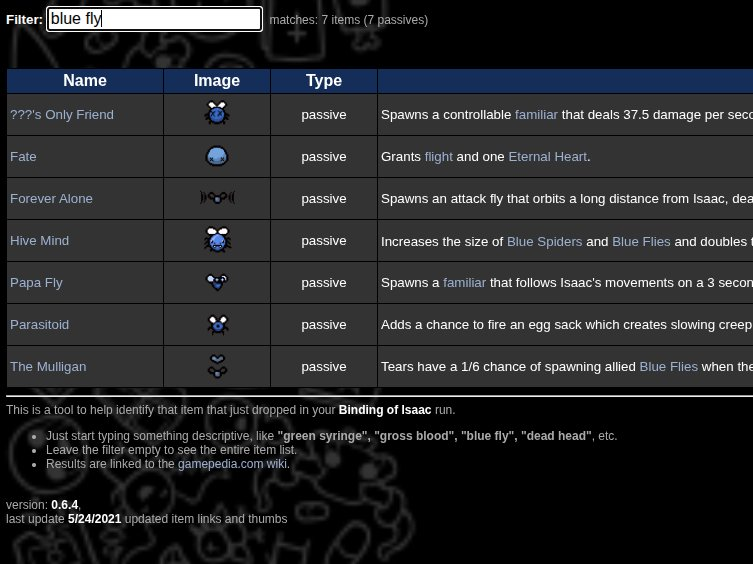

# The Finding of Isaac

This is a tool that visually identifies items in The Binding of Isaac.  Type something descriptive, like **syringe**, **gross blood**, or **blue fly**, etc.  Results linked to the [fandom wiki](https://bindingofisaacrebirth.fandom.com/wiki).

[The Finding of Isaac live site](https://mehyam.github.io/thefindingofisaac/)



## Architecture

Written in raw HTML, CSS, and Javascript, no dependencies or frameworks.  Has not been optimized at all, but is pretty simple and works well enough.

* no server or build, just open index.html directly in browser
* hosted currently in GitHub Pages, "build" deployed by merging main to gh-pages
* app logic all in thefindingofisaac.js
* itemdata/items.js - JSON-like file holding all item data, including the tags used when searching/filtering
  * item object shape:
```js
{
  id: "the d6",
  name: "The D6",
  type: "active",          // passive | active | trinket | card | rune
  subType: "...",
  desc: "<html>",          // wiki description with relative links
  dlc: "base",             // base | afterbirth | afterbirthplus | boosterpack1–5 | repentance
  colors: "blue red",      // space-separated color tags
  tags: "baby dead fly",   // space-separated descriptive tags
  thumb: "https://...",    // thumbnail - wiki URL base64-encoded image
  wiki: "https://..."      // Fandom wiki URL
}
```
* itemdata/aliases.js - hand-edited thesaurus for tags
* spritesheet/base64Thumbnails.js - base64-encoded item thumbnails, bespoke spritesheet

## Updating Data
Currently, the wiki items and images are scraped with some manually-run dev console utilities that live in scraper.js.  Workflow:

* open the isaac wiki page to scrape (eg. https://bindingofisaacrebirth.fandom.com/wiki/Items, see all scrape targets below)
* paste scraper.js into the dev console, run the following commands
  * 'listTables()' to help locate the table to scrape
  * 'copyTable(tableIndex, item-type)' to scrape the items to the clipboard
    * item-type is "active", "trinket", "card", "passive", "soul", etc
    * tableIndex can be an array of indexes, which helps pulling in multiple card tables
* open scraper.html in a browser and follow directions
  * paste the new items into items.js
* sanity check changes
  * search for "DLC_FIXME" in case dlc type needs to be set manually
* (optional, but highly recommended): use base64ImagePacker.js to generate new spritesheet
  * "npm run pack-images"
  * the app will fall back to loading image files from the wiki if they've not been packed
    * it generates warnings in the dev console when this happens
* temporarily open the page in admin mode (g_data.admin = true) to in-place edit/update item tags
* must manually save the tags to items.js afterwards, do copy/stringify on g_items when done and paste in items.js

### Current scrape targets
* https://bindingofisaacrebirth.fandom.com/wiki/Items - 2 tables
* https://bindingofisaacrebirth.fandom.com/wiki/Trinkets - 1 table
* https://bindingofisaacrebirth.fandom.com/wiki/Cards_and_Runes - 15 tables

## TO DO:
- automate more/all of the scraping
- npm outdated
- update data for 2026
	- fresh scrape
	- use ColorWeave to auto-generate color tags
	- more tags, starting items for player characters, etc
- more functionality/data
	- transformations
	- item pools
	- characters
	- bosses
	- item specific info?
		- Pandora's Box rewards
		- Spindown dice lookup
		- Book of Virtues, Lemegeton
- performance
	- table renders slowly (virtualize? "show all" button?)
	- return focus to text box after clicking link
- maybe improve text matches (i.e. "red" shouldn't match "credit" ?)
- add description to the sort options
